<p align="center">
  
</p>

# Metadata Visuals User Guide

This guide explains how to use Metadata Visuals in Obsidian after the plugin is installed and enabled.

Metadata Visuals turns frontmatter metadata into visual cues. A note can keep clean metadata such as:

```yaml
---
Editing Status: To Do
Editing Stage: Published
Importance: Critical
---
```

The plugin then displays configured colours and icons in the File Explorer, in folder rows, and in the visible note Properties panel. It can also bulk-update frontmatter values from the File Explorer context menu.

<p align="center">
  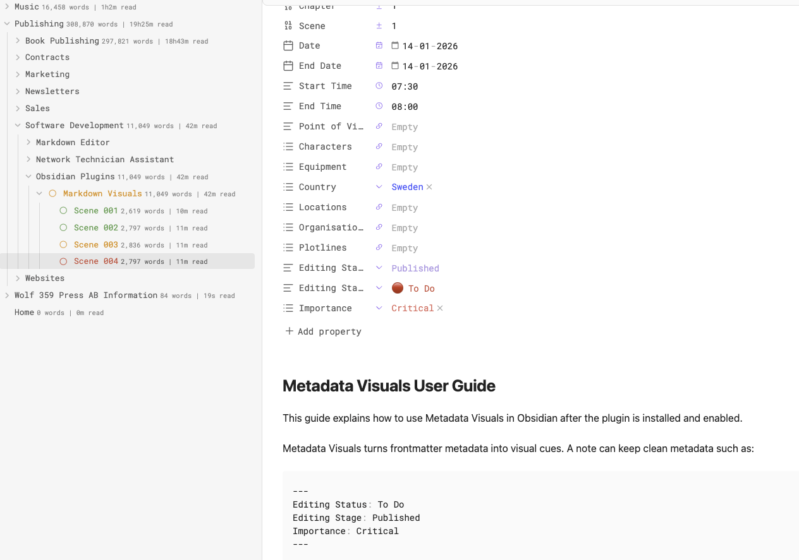
</p>

## Installation

For a manual test install, place these files in your vault plugin folder:

```text
<vault>/.obsidian/plugins/metadata-visuals/manifest.json
<vault>/.obsidian/plugins/metadata-visuals/main.js
<vault>/.obsidian/plugins/metadata-visuals/styles.css
<vault>/.obsidian/plugins/metadata-visuals/assets/icon.svg
```

Then open Obsidian Settings -> Community plugins, reload plugins if needed, and enable Metadata Visuals.

The plugin does not require Metadata Menu, Dataview, Iconize, Templater, internet access, or any runtime `node_modules` folder. Optional field-definition import is a one-time copy into Metadata Visuals' own settings.

## Core Concepts

### Metadata Field

A metadata field is the frontmatter property name, such as:

- `Editing Status`
- `Editing Stage`
- `Importance`
- `Type`

### Metadata Value

A metadata value is the content stored in that field, such as:

- `To Do`
- `In Progress`
- `Done`
- `Published`
- `Critical`

### Rule Group

A rule group belongs to one metadata field. For example, an `Editing Status` group can contain rows for `To Do`, `In Progress`, and `Done`.

Each row controls how one value looks:

- icon shape
- icon colour
- whether the File Explorer icon is shown
- whether the note or folder name is coloured
- whether the row applies to notes, folders, or both

### File Explorer Rule Group

Only one rule group can control File Explorer note and folder visuals at a time. This prevents one note from receiving competing icons or filename colours from several metadata fields.

The selected group is marked with `Use for File Explorer`.

Metadata/property colouring is different: it can use all matching rule groups.

### Known Values

Metadata Visuals creates table rows from known values for a metadata field.

Known values can come from:

- imported field definitions copied into Metadata Visuals' own settings;
- values already found in note frontmatter;
- the built-in Editing Status defaults.

When both imported values and used values exist, Metadata Visuals merges them, removes duplicates, normalises old emoji-prefixed values, and sorts common workflow values as `To Do`, `In Progress`, `Done` before sorting the remaining values alphabetically.

## First Setup

1. Open Obsidian Settings.
2. Open Metadata Visuals.
3. In the Rules header, choose a metadata field from the `Select` field.
4. Click `Add rule`.
5. Review the generated rows.
6. Choose the shape, colour, icon/name toggles, and target for each value.

Metadata Visuals creates rows from available values for the selected field. It can use values already found in your notes and values imported from known field-definition sources. You do not need to run a separate import step before adding a rule group; Metadata Visuals imports known definitions automatically in the background before creating the rows.

<p align="center">
  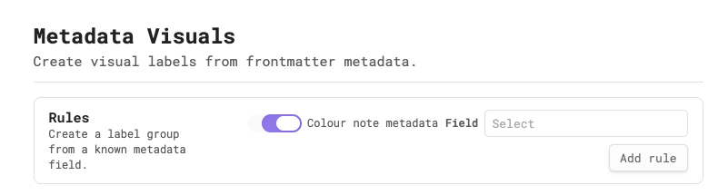
</p>

## Default Editing Status Rules

If no useful rules exist, Metadata Visuals creates three default rules:

| Field | Value | Shape | Colour | Icon | Name | Target |
| --- | --- | --- | --- | --- | --- | --- |
| Editing Status | To Do | circle | red | on | on | both |
| Editing Status | In Progress | circle | orange | on | on | both |
| Editing Status | Done | circle | green | on | on | both |

These defaults store clean metadata values. Emoji are not stored in the rule value.

Older notes that contain values such as `🔴 To Do`, `🟠 In Progress`, or `🟢 Done` still match because Metadata Visuals normalises leading status emoji before comparing values.

The default values are also stored in Metadata Visuals' internal known-value registry so a fresh Editing Status group can regenerate the three rows even if the values are not yet used in notes.

<p align="center">
  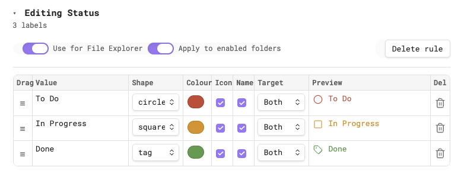
</p>

## The Rules Header

The top Rules area contains:

- `Colour note metadata`: turns Properties panel colouring on or off.
- `Select`: chooses a metadata field for a new rule group.
- `Add rule`: creates a rule group for the selected field.

The field selector starts blank. `Add rule` remains disabled until a real field is selected.

When you click `Add rule`, Metadata Visuals first tries to import known field definitions in the background. If no definitions are found, it uses values already found in note frontmatter. If both imported values and used values exist, it includes both.

<p align="center">
  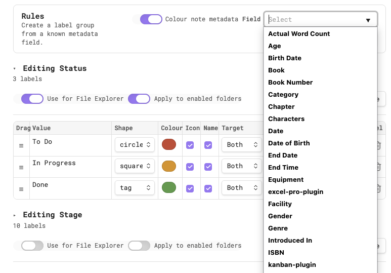
</p>

## Rule Group Header

Each rule group header shows:

- collapse/expand chevron
- metadata field name
- label count
- `Use for File Explorer`
- `Apply to enabled folders`
- `Delete rule`

Click the header to collapse or expand the group. Collapsed state is saved and restored after restart.

The metadata field name is read-only. Field selection happens only when creating a new rule group.

There is no manual `Add row` or `Add missing rows` control. A group is generated from the available values for its field. If you need more rows, add or import the missing values and recreate the group.

<p align="center">
  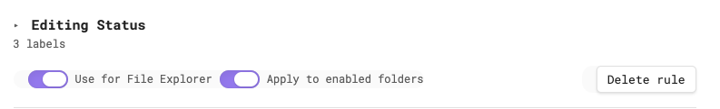
</p>

## Rule Table Columns

| Column | Meaning |
| --- | --- |
| Drag | Drag handle for reordering rows inside the group. |
| Value | Read-only metadata value. |
| Shape | Icon shape shown in the File Explorer when icons are enabled. |
| Colour | Rule colour. |
| Icon | Whether to show the File Explorer icon. |
| Name | Whether to colour the note or folder name. |
| Target | Whether the rule applies to notes, folders, or both. |
| Preview | Preview of the icon/name effect. |
| Del | Delete this row. |

Rows are generated from known values for the field. You do not manually type values into the table.

The Value column is read-only by design. This keeps visual configuration separate from the vocabulary used in your frontmatter. Delete a row if you do not want that value to create a visual label.

Drag rows by the handle to change their order. The order is saved in plugin settings and restored after restart. Preview text wraps for long values so the table stays readable inside the settings pane.

<p align="center">
  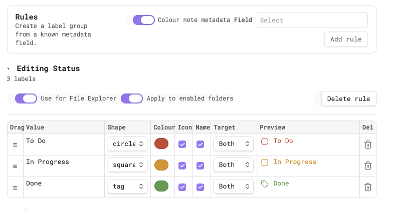
</p>

## File Explorer Labels

To colour notes in the File Explorer:

1. Create a rule group.
2. Turn on `Use for File Explorer` for that group.
3. Configure each row.

Only the selected File Explorer group controls icons and filename colour.

For each matching note:

- if `Icon` is enabled, the configured icon is inserted before the note name;
- if `Name` is enabled, the note name uses the configured colour;
- if both are disabled, the note receives no visible File Explorer effect.

Rule order matters within the selected group. The first matching rule wins.

<p align="center">
  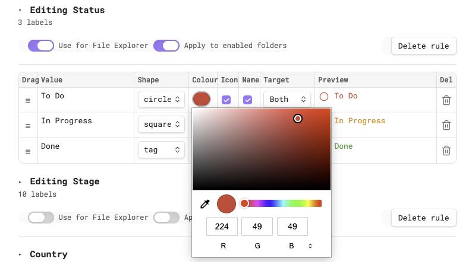
</p>

## Note Properties Colouring

The `Colour note metadata` toggle controls colouring in the visible note Properties panel.

When enabled, all matching rule groups can colour their own matching field/value pairs.

Example:

| Property | Value | Result |
| --- | --- | --- |
| Editing Status | To Do | Uses the To Do rule colour. |
| Editing Stage | Published | Uses the Published rule colour. |
| Importance | Critical | Uses the Critical rule colour. |

This feature does not depend on `Use for File Explorer`. A group can colour Properties values even if another group controls the File Explorer.

If you turn `Colour note metadata` off, Metadata Visuals removes its injected property colours.

<p align="center">
  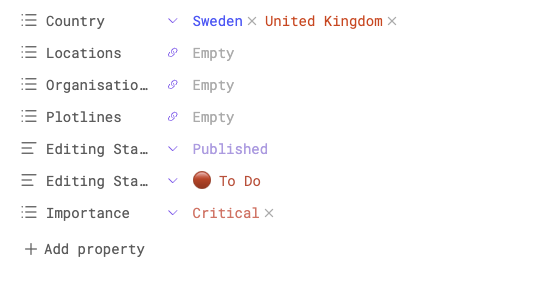
</p>

## Smart Folders

Smart folders allow folders to inherit a visual rule from descendant notes.

There are two steps:

1. Right-click a folder in the File Explorer and choose `Metadata Visuals > Enable smart folder rule`.
2. In settings, enable `Apply to enabled folders` for the rule group that should drive folder inheritance.

Smart folder inheritance uses the active File Explorer rule group. This keeps folder visuals aligned with the same metadata workflow used for note rows.

Smart folders refresh when descendant metadata changes, files are created, deleted, or renamed, and when the File Explorer refreshes. Enabled folder paths are controlled only from the folder context menu; the settings page stays clean and only stores the per-field `Apply to enabled folders` choice.

### Editing Status Aggregation

For an Editing Status workflow, Metadata Visuals checks descendant markdown notes that have the relevant metadata field.

Folder-note/dashboard files that represent the folder itself are ignored.

Aggregation:

- If no descendant notes have a counted status, no folder rule applies.
- If any descendant note is `In Progress`, the folder is `In Progress`.
- If at least one descendant note is `Done` and at least one is `To Do`, the folder is `In Progress`.
- If all counted descendant notes are `Done`, the folder is `Done`.
- If all counted descendant notes are `To Do`, the folder is `To Do`.

The folder then uses the matching rule's shape, colour, icon toggle, name toggle, and target setting.

<p align="center">
  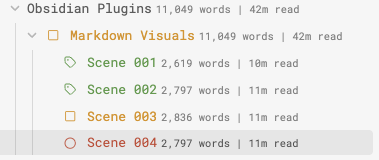
</p>

## Folder Context Menu

Right-click a folder in the File Explorer.

You will see:

```text
Metadata Visuals >
  Enable smart folder rule
```

If the folder is already enabled:

```text
Metadata Visuals >
  Disable smart folder rule
```

Disabling a smart folder immediately removes its injected styling.

<p align="center">
  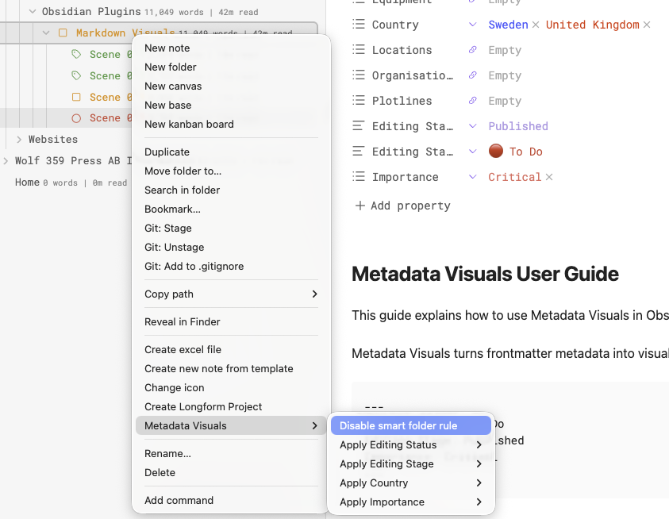
</p>

## Bulk Metadata Updates

Metadata Visuals adds bulk update actions to File Explorer context menus.

Example:

```text
Metadata Visuals >
  Apply Editing Status >
    To Do
    In Progress
    Done
```

Selecting a value writes that raw value into frontmatter.

For example, `Apply Editing Status > Done` writes:

```yaml
Editing Status: Done
```

It does not write an emoji, icon name, colour, or preview label.

Bulk updates support:

- one selected note;
- multiple selected notes;
- selected folders;
- mixed note and folder selections.

When a folder is selected, Metadata Visuals updates all descendant markdown notes. If selected folders overlap, each note is updated only once.

Existing frontmatter is preserved as YAML data. Notes without frontmatter receive a new frontmatter block.

<div align="center">
  <p><strong>Before</strong></p>
  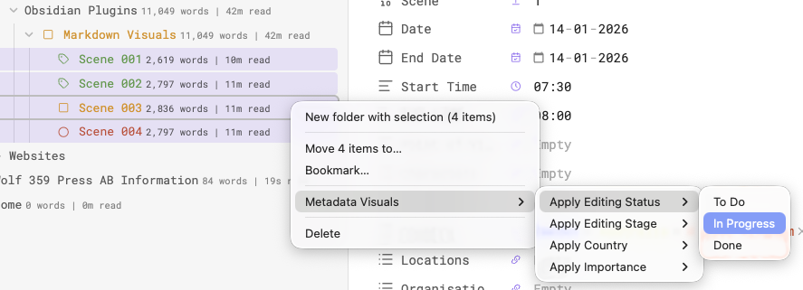
  <br>
  <br>
  <p><strong>After</strong></p>
  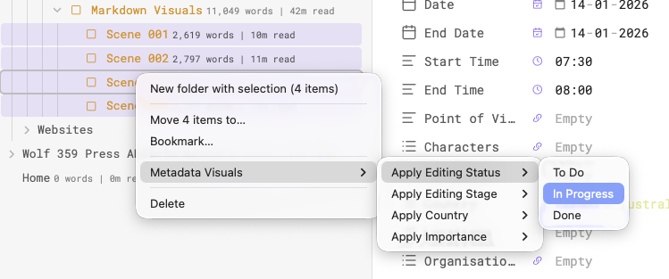
</div>

## Field Definition Import

Metadata Visuals can import configured possible values from known local sources. Currently, it can read Metadata Menu's local `data.json` if it exists.

This is a one-time copy:

- Metadata Visuals imports field names and possible values.
- Imported values are saved into Metadata Visuals' own settings.
- Metadata Visuals does not require Metadata Menu at runtime.
- If Metadata Menu is removed later, imported values remain available.

This is useful when a field has possible values that have not been used in any note yet.

Import runs quietly when the settings page opens and again before a new rule group is created. If no supported definition file exists, Metadata Visuals falls back to values already used in notes. The plugin remains fully standalone after import because it stores imported values in its own `data.json`.

<div style="color: #d22; border-left: 4px solid #d22; padding-left: 0.75rem;">
<strong>Screenshot 12 placeholder:</strong> Upload a field-import result screenshot named <code>screenshots/imported-field-values.png</code>. It should show a newly added rule group populated with values that came from imported field definitions, such as an <code>Editing Stage</code> group with many stage rows including values that are not currently used in notes.
</div>

## About And Support Footer

The bottom of the settings page shows the official Metadata Visuals logo, the installed plugin version, creator credit, and support links.

The footer buttons are:

- Report a bug
- Feature request
- wolf359.app
- Wolf 359 Press
- Buy me a coffee

`Buy me a coffee` is visually highlighted. All links open in the system browser.

<div style="color: #d22; border-left: 4px solid #d22; padding-left: 0.75rem;">
<strong>Screenshot 13 placeholder:</strong> Upload a footer screenshot named <code>screenshots/about-support-footer.png</code>. It should show the bottom of Settings -&gt; Metadata Visuals with the official logo, <code>Metadata Visuals</code> title, version number, <code>Created by Anthony Fitzpatrick</code>, <code>Wolf 359 Press AB</code>, and the five support buttons in this exact order: <code>Report a bug</code>, <code>Feature request</code>, <code>wolf359.app</code>, <code>Wolf 359 Press</code>, <code>Buy me a coffee</code>. Capture it in a clean theme where the logo and buttons are readable.
</div>

## Value Normalisation

Metadata Visuals compares values after normalising leading status emoji.

These values are treated as equivalent:

```yaml
Editing Status: To Do
Editing Status: 🔴 To Do
```

This exists for backwards compatibility with older notes and older default rules.

## Recommended Workflows

### Editing Status

Use this for manuscript progress:

- To Do
- In Progress
- Done

Enable `Use for File Explorer` if you want note and folder rows to show progress.

### Editing Stage

Use this for detailed production stages:

- First Draft
- Developmental Edit
- Beta Readers
- Final Edit
- Published

Leave `Use for File Explorer` off if Editing Status already controls File Explorer visuals. The Editing Stage group can still colour Properties values.

### Importance

Use this for priority:

- Critical
- Major
- Minor

This works well for Properties colouring, and can also control File Explorer visuals if priority is more important than status in your vault.

## Troubleshooting

### I do not see a field in the Add Rule selector

The field must be known to Metadata Visuals. It becomes known when:

- the field exists in frontmatter in at least one note; or
- the field was imported from a supported field-definition source.

Create one note using the field, then reopen settings or click Add rule again.

### Add Rule created fewer rows than expected

Rows are created from:

- imported possible values;
- values already found in frontmatter.

If a possible value has never been imported and is not used in any note, Metadata Visuals cannot discover it from Obsidian core alone.

### File Explorer colours do not match the Properties colours

This is usually expected.

File Explorer visuals use only the group marked `Use for File Explorer`. Properties colouring can use all matching groups.

### A folder is not inheriting a status

Check that:

- the folder is enabled from the folder context menu;
- `Apply to enabled folders` is on for the active File Explorer rule group;
- descendant notes have the relevant metadata field;
- the rule group contains matching values.

### Property values are not coloured

Check that:

- `Colour note metadata` is enabled;
- the note has a matching field/value pair;
- the Properties panel is visible;
- the rule value matches the stored frontmatter value after normalisation.

### I disabled a rule but stale colours remain

Metadata Visuals clears old injected styles before reapplying. If Obsidian has not rerendered the current pane yet, switch notes or trigger a layout refresh.

## Compatibility

Metadata Visuals is designed to support Obsidian 1.12.7.

The settings UI uses classic `PluginSettingTab.display()` intentionally. It does not use the newer declarative settings API.

## Data Stored By The Plugin

Metadata Visuals stores:

- visual rules;
- enabled smart folder paths;
- fields enabled for smart folder inheritance;
- imported possible values;
- the selected File Explorer rule group;
- whether Properties colouring is enabled;
- collapsed/expanded state for settings rule groups.

It does not alter your notes except when you explicitly use bulk metadata update actions.

## Uninstalling

1. Disable Metadata Visuals in Obsidian.
2. Remove the plugin folder if desired.

The plugin removes its injected File Explorer and Properties styles when unloaded. Your frontmatter values remain unchanged, except for metadata you intentionally changed through bulk update actions.

---

<p align="center">
  <a href="https://wolf359.app/metadata-visuals/report-bug/">🐞 Report a bug</a> |
  <a href="https://wolf359.app/metadata-visuals/request-feature/">💡 Feature request</a> |
  <a href="https://wolf359.app/">🌐 wolf359.app</a> |
  <a href="https://wolf359.press/">📚 Wolf 359 Press</a> |
  <a href="https://buymeacoffee.com/wolf359pressab"> Buy me a coffee</a>
</p>
